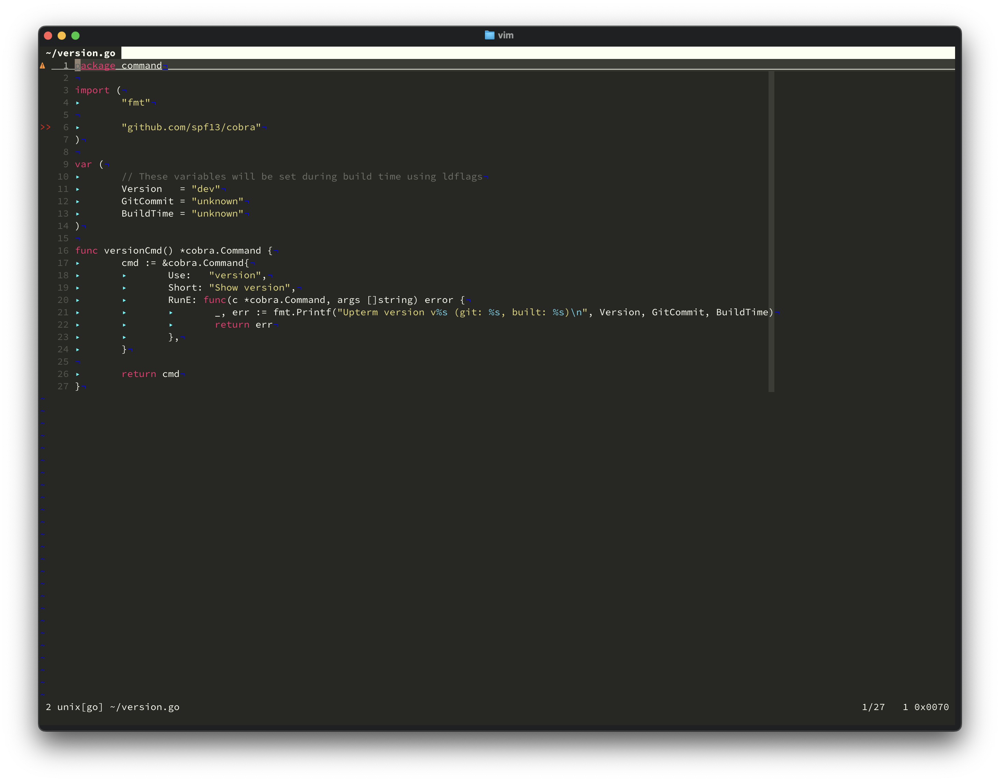
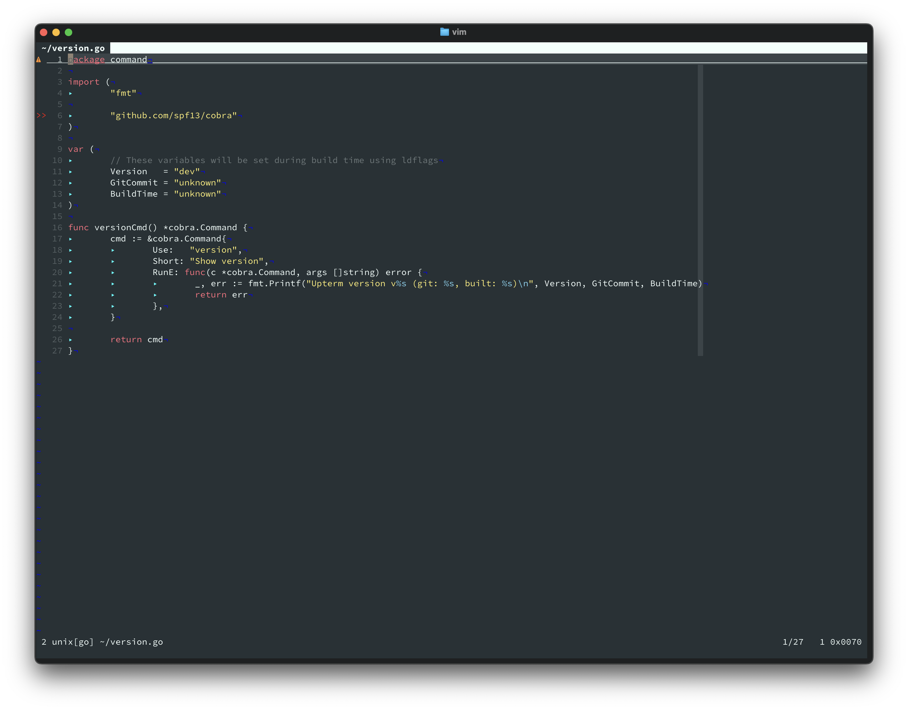
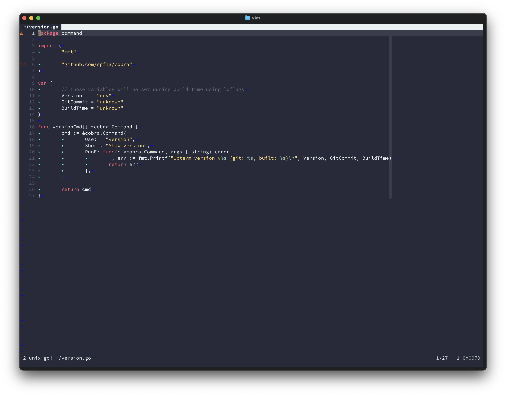
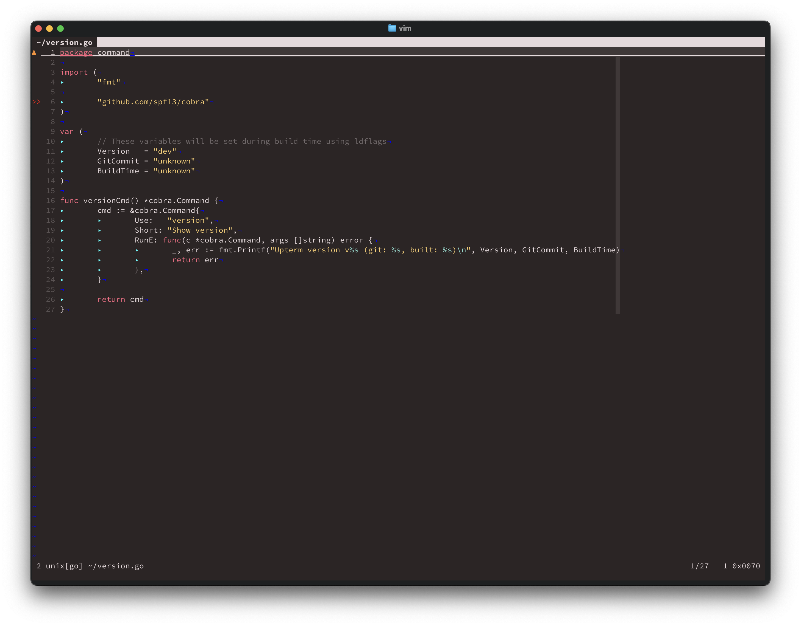
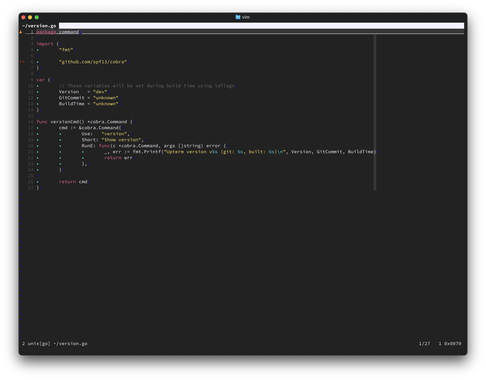
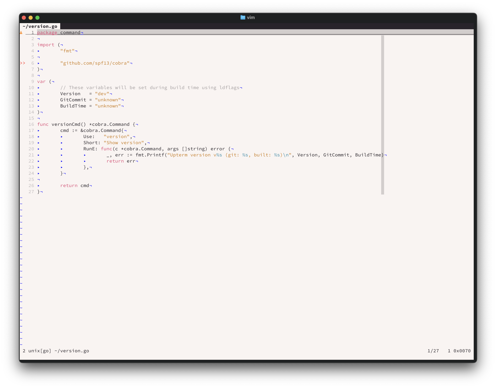

# Monokai Pro for Vim

Beautiful Monokai Pro theme variants for Vim, ported from the excellent [monokai-pro.nvim](https://github.com/gthelding/monokai-pro.nvim) by gthelding.


## Features

This plugin includes all 7 Monokai Pro variants:

- **monokai-pro** - Default Monokai Pro
- **monokai-pro-classic** - Classic Monokai colors
- **monokai-pro-machine** - Dark blue variant
- **monokai-pro-octagon** - Dark purple variant
- **monokai-pro-ristretto** - Dark brown variant
- **monokai-pro-spectrum** - True black background
- **monokai-pro-light** - Light variant

## Installation

### Using [vim-plug](https://github.com/junegunn/vim-plug)

```vim
Plug 'vinitkumar/monokai-pro-vim'
```

### Using [packer-nvim](https://github.com/wbthomason/packer.nvim)

```
use 'vinitkumar/monokai-pro-vim'
```

### Using [Vundle](https://github.com/VundleVim/Vundle.vim)

```vim
Plugin 'vinitkumar/monokai-pro-vim'
```

### Using [Pathogen](https://github.com/tpope/vim-pathogen)

```bash
cd ~/.vim/bundle
git clone https://github.com/vinitkumar/monokai-pro-vim.git
```

### Manual Installation

```bash
git clone https://github.com/vinitkumar/monokai-pro-vim.git
cp -r monokai-pro-vim/colors ~/.vim/
```

## Usage

After installation, you can set the colorscheme in your `.vimrc`:

```vim
colorscheme monokai-pro
```

Or try other variants:

```vim
colorscheme monokai-pro-classic
colorscheme monokai-pro-machine
colorscheme monokai-pro-octagon
colorscheme monokai-pro-ristretto
colorscheme monokai-pro-spectrum
colorscheme monokai-pro-light
```

You can also switch themes on the fly:

```vim
:colorscheme monokai-pro-machine
```

## Requirements

- Vim 7.0+ with `+termguicolors` support for best results
- For terminal Vim, your terminal should support true colors

To enable true colors in Vim, add this to your `.vimrc`:

```vim
if has('termguicolors')
  set termguicolors
endif
```

## Screenshots


### Monokai Pro Classic
Classic Monokai colors that you know and love.



### Monokai Pro Machine
A blue-tinted variant with a cooler color palette.



### Monokai Pro Octagon
A purple-tinted variant with muted colors.



### Monokai Pro Ristretto
A warm, brown-tinted variant.



### Monokai Pro Spectrum
True black background variant for OLED displays.



### Monokai Pro Light
A light variant for daytime coding.



## Credits

- Original Neovim theme by [gthelding](https://github.com/gthelding/monokai-pro.nvim)
- Based on the original [Monokai Pro](https://monokai.pro/) theme
- Ported to Vim by [Vinit Kumar](https://github.com/vinitkumar)

## License

MIT License - see [LICENSE](LICENSE) file for details.

## Contributing

Feel free to open issues or submit pull requests if you find any problems or have suggestions for improvements.
